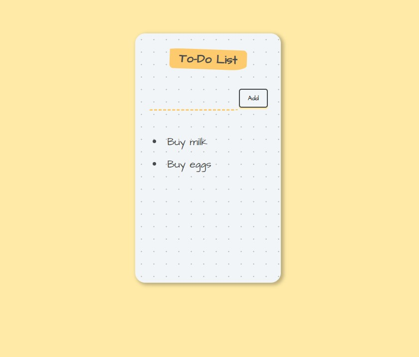

# 📝 React To-Do List App


A simple and clean **To-Do List application** built with **React functional components** and the `useState` hook.  
This project is ideal for beginners who want to understand **controlled inputs**, **state management**, and **dynamic list rendering** in React.

---

## ✨ Features

- Add new to-do items
- Controlled input field
- Dynamic rendering of list items
- Simple and playful UI using pure CSS
- Beginner-friendly React structure

---

## 🛠️ Built With

- **React** (Functional Components)
- **React Hooks** (`useState`)
- **CSS** (custom styling)
- **JavaScript (ES6)**

---
## Screenshot

Here’s what the app looks like:




---

## 📂 Project Structure

```text
.
├── index.html
├── package-lock.json
├── package.json
├── public
│   └── styles.css
├── src
│   ├── components
│   │   └── App.jsx
│   └── index.jsx
└── vite.config.js
```
---
## Getting Started

To run this project locally, follow these steps:

1. **Clone the repository**  
   ```bash
   git clone <your-repo-url>
   cd <your-repo-folder>
   ```
2. **Install dependencies**  
   ```bash
   npm install

   ```
3. **Start the development server**  
   ```bash
   npm run dev

   ```
4. Open your browser and go to the URL shown in the terminal (usually http://localhost:5173) to see the app running.

---
## What You’ll Learn From This Project

This project is a simple React To-Do List app that helps you practice and understand:

- **React Basics**: Functional components, JSX, and props  
- **State Management**: Using the `useState` hook to manage input and list data  
- **Handling Events**: Capturing user input and handling button clicks  
- **Rendering Lists**: Mapping over arrays to render dynamic lists in the UI  
- **Basic Styling**: Applying CSS for layout, colors, and interactive elements  
- **Project Structure**: Organizing React components and assets in a clean folder structure  

