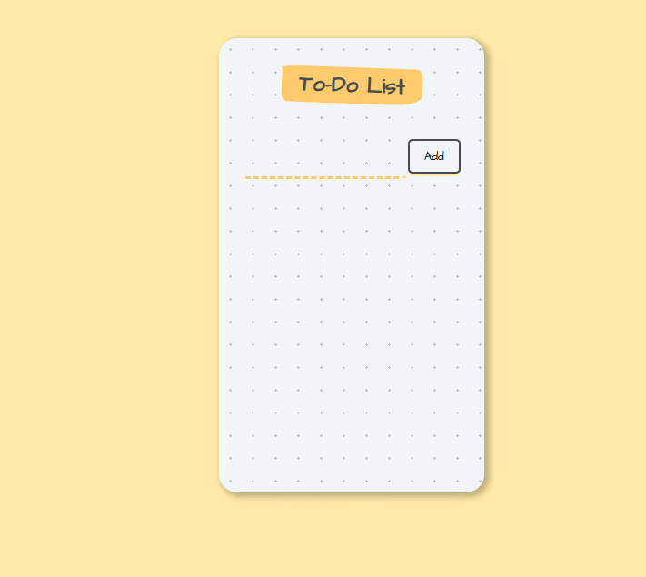

# 📝 React To-Do List App


A simple yet well-structured **To-Do List application** built with **React functional components** and the `useState` hook.  
This project is ideal for beginners who want to practice **controlled inputs**, **state lifting**, and **clean component architecture** in React.

---

## ✨ Features

- Add new to-do items
- Controlled input field
- Unique IDs for each item using `uuid`
- Dynamic rendering of list items
- Click-to-complete behavior
- **Click an item to apply a line-through, then automatically delete it after a short delay**
- Clean and beginner-friendly UI using pure CSS
- Well-organized component-based structure

---

## 🛠️ Built With

- **React** (Functional Components)
- **React Hooks** (`useState`)
- **Vite** (Fast development environment)
- **UUID** (Unique item identifiers)
- **CSS** (custom styling)
- **JavaScript (ES6)**

---

## 📸 Screenshot / Demo

Here’s what the app looks like:



---

## 📂 Project Structure

```text
.
├── index.html
├── package.json
├── package-lock.json
├── vite.config.js
├── README.md
├── public
│   ├── styles.css
│   └── To-Do-List.gif
└── src
    ├── index.jsx
    └── components
        ├── App.jsx
        ├── InputArea.jsx
        └── ToDoItem.jsx

```
---
## Getting Started

To run this project locally, follow these steps:

1. **Clone the repository**  
   ```bash
   git clone https://github.com/pouriavj/react-ToDoList.git
   cd react-ToDoList
   ```
2. **Install dependencies**  
   ```bash
   npm install

   ```
3. **Start the development server**  
   ```bash
   npm run dev

   ```
4. Open your browser and go to the URL shown in the terminal (http://localhost:5173) to see the app running.

---
## 📚 What You’ll Learn From This Project

By building this project, you will practice and understand:

- **React Fundamentals**: Writing functional components and using JSX effectively
- **State Management**: Managing local component state with the `useState` hook
- **Lifting State Up**: Keeping shared state in a parent component (`App`)
- **Controlled Components**: Handling form inputs using React state
- **Event Handling**: Responding to user interactions like clicks and input changes
- **Rendering Lists**: Dynamically rendering items using `.map()` with unique keys
- **Component Communication**: Passing data and callback functions via props
- **UI Feedback Patterns**: Showing a temporary visual state (line-through) before removing data
- **Timed Actions**: Using `setTimeout` to delay logic execution for better UX
- **Project Organization**: Structuring a React + Vite project in a clean and scalable way

---
## ✅ Notes

> [!NOTE]
> The `map()` method is used to render the list of to-do items from the state array, ensuring each item is displayed dynamically based on current data.
> 
> The `filter()` method is used to remove items from the state by creating a new array without the selected item, preserving immutability and triggering a proper re-render.


